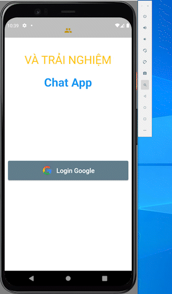
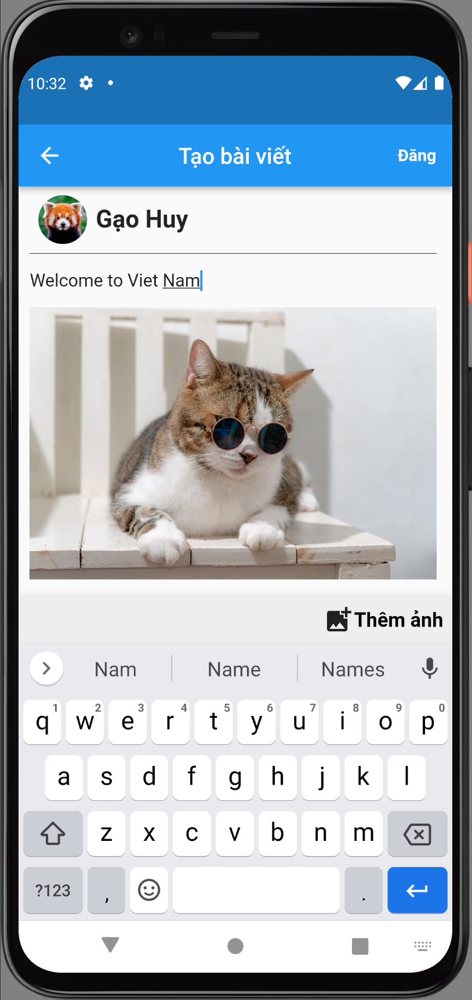
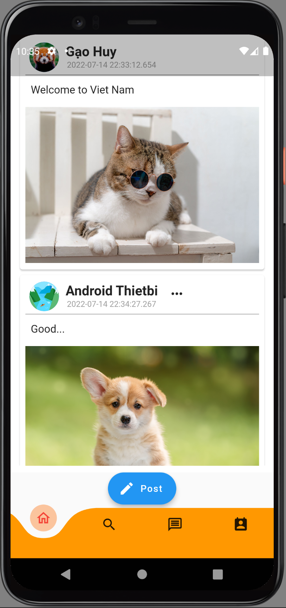
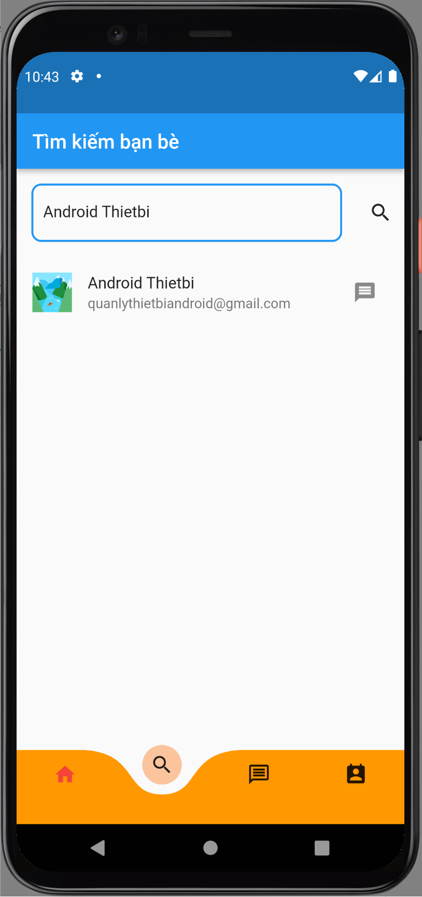
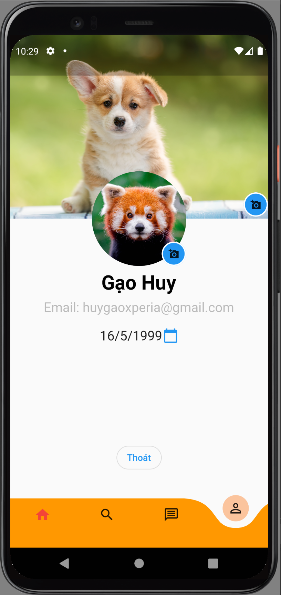

# Firebase Chat App

**_[Language VietNamese]_**

Ứng dụng Firebase Chap App được triển khai trên framework Flutter và được viết bằng ngôn ngữ Dart. Cơ sở dữ liệu được lưu dưới dạng NoSQL(Firebase), Ứng dụng chạy trên cả 2 hệ điều hành Android và iOS. Firebase Chat app có thể chat qua lại giữa 2 người, có thể gửi ảnh và post ảnh...

## 🔑Features
Ứng dụng có các tính năng cơ bản của 1 Chat app.
  * Đăng nhập bằng account Google.
  * Post ảnh
   
  
  * Tìm kiếm bạn bè
  
  
  * Chat
  
  
  * Cập nhật Avatar, background, birthday
  
  
  * Đăng xuất
  
Một số tính năng còn thiếu, sắp được bổ sung: Profile, Like button, Comment, Status.

## 🔧Installation setup

Cấu trúc NoSQL(Firebase) của Firebase Chat app để lưu trữ tin nhắn

[Hướng dẫn thiết đặt ban đầu cho Firebase](https://firebase.google.com/docs?gclid=CjwKCAjw_b6WBhAQEiwAp4HyIG0UBqg2OYllVTB5-64IxhymvvmBBFxCAkOb5ktZQE7TjXNjNG3KmRoCW3UQAvD_BwE&gclsrc=aw.ds)
[Package Source Firebase](https://firebase.flutter.dev/)
[Install Flutter SDK](https://docs.flutter.dev/get-started/install)

## 📘Main libraries used

Cái package mà đã sử dụng trong dự án Firebase Chat App của tôi [tại dây](/firebase_chat_app/pubspec.yaml)

## 🌏Other Social Media

📌[GitHub](https://github.com/HuygaoBE)

📌[FaceBook](https://www.facebook.com/profile.php?id=100007416721622)

Vui lòng đánh giá sao cho các dự án của tôi trên GitHub, để tôi có thêm động lực để tạo ra nhiều dự án hữu ích cho cộng đồng.
